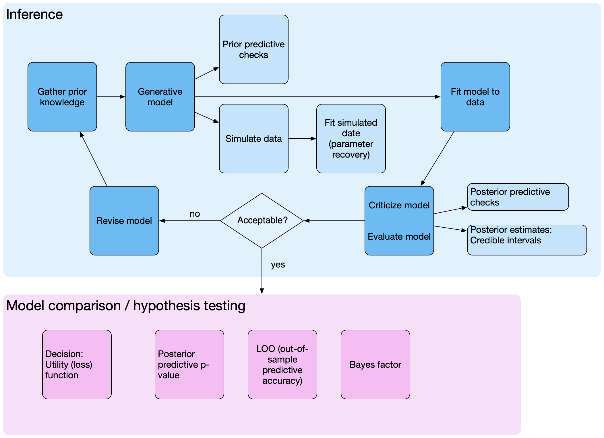

```{r setup, include=FALSE}
knitr::opts_chunk$set(echo = FALSE)
```


The following figure illustrates the steps that are ideally involved in data analysis. Whereas traditional approaches often combine inference and hypothesis testing, and consist of applying off-the-shelf methods, data analysis involves many more steps.


```{r echo=FALSE, layout="l-screen-inset"}

```

1) Starting at the beginning, we gather all the knowledge we habe about our data analysis problem. This includes deciding which data to collect, which hypotheses to formulate, quantifying our prior knowledge about our parameters. 

2) From this we formulate a generative model, which is a joint probability model of the data and all parameters. 

3) Once we have this, we can perform prior predictve checks. This will inform us about the data our model expects to see, and can tell if our models make sense. If the model makes nonsensical predictions, it might have to be revised.

4) We can can then simulate data from our model using a set of known parameters, and use these data in order to recover the parameters. This is an important step when using complex models, as this will tell us whether our model can recover parameters. If our model fails to do so, it needs revising.

5) Once we have gathered data, we can fit our model to the data by applying Bayes theorem. This will gives a joint posterior distribution of all the parameters.

6) Using posterior predictive checks, we can investigate whether our model can capture patterns n the data. This is an important step in deciding wtether a model is mis-specified.

7) At this point, we may decide to revise our model, thus completing the loop.

8) If we are happy that the model captures all relevant aspects of the data, we can use/interpret the posterior estimates, or we can perform model comparison.

9) We can compare several candidate models using posterior predictive checks or approximate out-of -sample predictive accuracy.

10) Hypothesis testing is a form of model comparison. Bayes factors can quantify relative evidence for one model over another.
