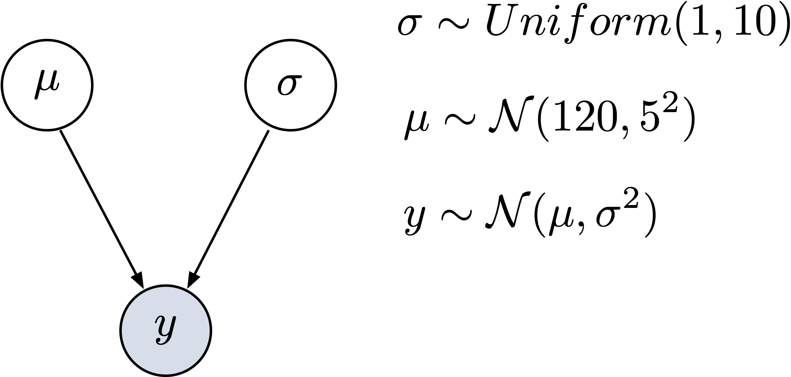

```{r child = "setup.Rmd"}
```

```{r load-packages, include=FALSE, warning=FALSE}
library(tidyverse)
library(rmarkdown)
library(countdown)
library(kableExtra)

theme_set(theme_grey(base_size = 14) +
            theme(panel.grid = element_blank()))
```


## Parameters are random variables

- Parameters are random variables and have a distribution.

- Parameters' probability distributions are used to quantify uncertainty.

- The prior distribution is updated by multiplying with the likelihood to obtain the posterior distribution.


## 3 steps of Bayesian data analysis 


1. Specify a joint probability model for data $(y, x)$ and all parameters $\theta$).

2. Compute the posterior distribution $P(θ | y) \sim P(y | \theta) \cdot p(\theta)$, conditioned on observed data.

3. Evaluate the model and the posterior distributions.
  + How well does the model fit the data?
  + Can we draw any substantive conlcusions?
  + How are sensotive are these to our prior distributions?
  
---

## Example

Consider an example. You watch two people (A and B) playing cards. A wins 6 games out of 9. You would like to estimate the probability that A will win the next N games. 

```{r}
wins <- 6
games <- 9
```


.your-turn[
- How would you go about estimating this probability? 
- How would you quantify your uncertainty?

]

```{r echo=FALSE}
countdown(minutes = 2)
```

---
Assuming that both players are equally likely to win, we can compute the probability that A will win 6 times out of 9.


```{r}
dbinom(x = wins, size = games, prob = 0.5)
```


---

We can compute the cumulative probaility that A will win 5 games or fewer

```{r}
pbinom(q = 5, size = games, prob = 0.5)
```

or the cumulative probaility that A will win more than 5 games

```{r}
1 - pbinom(q = 5, size = games, prob = 0.5)
# pbinom(q = 5, size = games, prob = 0.5, lower.tail = FALSE)
`````

---

## Point estimate

 A point estimate of the probability that A will win:
 
 
.panelset[
.panel[.panel-name[Maximum likelihood estimate]

```{r}
theta <- wins/games
theta
```
]

.panel[.panel-name[Likelihood]

```{r echo=FALSE}
tibble(x = seq(from = 0, to = 1, by = .01)) %>% 
  mutate(density = dbinom(6, 9, x)) %>% 
  
  ggplot(aes(x = x, ymin = 0, ymax = density)) +
  geom_ribbon(size = 0, alpha = 1/4, fill = "steelblue") +
  geom_vline(xintercept = theta, linetype = 2, size = 1.2) +
  scale_y_continuous(NULL, breaks = NULL) +
  coord_cartesian(xlim = c(0, 1)) +
  xlab("Wahrscheinlichkeit") +
  theme(panel.grid = element_blank(),
        legend.position = "none")
```
]]

---

## Bayes' Theorem

If we want to obtain a distribution for $\theta$, we can use Bayes theorem.

$$ P(\theta|Data) = \frac{ P(Data|\theta) * P(\theta) } {P(Data)}$$
$P(Data)$ is a normalising constant and is often omitted


$$ P(\theta|Data) \propto P(Data|\theta) * P(\theta) $$

---

We need both $P(Data|\theta)$ and $P(\theta)$. 

.panelset[
.panel[.panel-name[Binomial likelihood]

$P(Data|\theta)$ is the probability of obtaining $k$ wins in $n$ games:

$$ P(x = k) = {n \choose k} \theta^k (1-\theta)^{n-k} $$
]
.panel[.panel-name[Prior]

$P(\theta)$ is the prior distribution of the parameter $\theta$. 

This expresses our prior belief of A's chances of winning. 

If we don't know anything about A or B, we could just assume that all parameter values are equally likely to occur. Since $\theta$ is a probability, our prior is uniform on the interval $\left(0, 1\right) = \{x \in \mathbb{R} | 0 < x < 1 \}$.

]]


---

## Estimating the parameter of a binomial distribution


```{r}
wins <- 6
games <- 9
```

### Maximum likelihood estimate

```{r}
theta <- wins/games
theta
```

---

```{r echo=FALSE}
tibble(x = seq(from = 0, to = 1, by = .01)) %>% 
  mutate(density = dbinom(6, 9, x)) %>% 
  
  ggplot(aes(x = x, ymin = 0, ymax = density)) +
  geom_ribbon(size = 0, alpha = 1/4, fill = "steelblue") +
  geom_vline(xintercept = theta, linetype = 2, size = 1.2) +
  scale_y_continuous(NULL, breaks = NULL) +
  coord_cartesian(xlim = c(0, 1)) +
  xlab("Parameter") +
  theme(panel.grid = element_blank(),
        legend.position = "none")
```

---

## Estimating the posterior via grid approximation

.panelset[
.panel[.panel-name[Grid]

```{r}
n_points <- 100
theta_grid <- seq(from = 0 , to = 1 , length.out = n_points)
```

]

.panel[.panel-name[Likelihood]
```{r}
likelihood <- dbinom(wins , size = games , prob = theta_grid)

```
]

.panel[.panel-name[Prior]
```{r}
prior <- dbeta(x = theta_grid, shape1 = 4,  shape2 = 4)

```
]
]

---

## Estimating the posterior via grid approximation


.panelset[
.panel[.panel-name[Posterior]

```{r}
unstandardized_posterior <- likelihood * prior
posterior <- unstandardized_posterior / sum(unstandardized_posterior)
```

]

.panel[.panel-name[Code for plot]
```{r echo=TRUE, eval=FALSE}
d <- tibble(theta_grid, prior, likelihood, posterior)

d %>%
  pivot_longer(-theta_grid, names_to = "distribution", values_to = "density") %>% 
  mutate(distribution = as_factor(distribution)) %>% 
  ggplot(aes(theta_grid, density, color = distribution)) +
  geom_line(size = 1.5) +
  geom_vline(xintercept = 9/10, linetype = "dashed") +
  scale_color_viridis_d(end = 0.8) +
  xlab("Theta values") +
  ylab("") +
  facet_wrap(~distribution, scales = "free_y") +
  theme_bw() +
  theme(legend.position = "none")
```
]

.panel[.panel-name[Plot]

```{r echo=FALSE}
d <- tibble(theta_grid, prior, likelihood, posterior)

d %>%
  pivot_longer(-theta_grid, names_to = "distribution", values_to = "density") %>% 
  mutate(distribution = as_factor(distribution)) %>% 
  ggplot(aes(theta_grid, density, color = distribution)) +
  geom_line(size = 1.5) +
  geom_vline(xintercept = 9/10, linetype = "dashed") +
  scale_color_viridis_d(end = 0.8) +
  xlab("Theta values") +
  ylab("") +
  facet_wrap(~distribution, scales = "free_y") +
  theme_bw() +
  theme(legend.position = "none")
```
]
]


---

## Summarize the posterior


If we want to sumarize the posterior, this means computing integrals (area under curve). If we don't wnat to (or can't) integrate, we can draw samples from the posterior and use a Monte Carlo approximation.


.panelset[
.panel[.panel-name[N. samples]
```{r}
n_samples <- 1e4
set.seed(3) 
```

```{r echo=TRUE}
d %>%
    paged_table(options = list(rows.print = 6))
```

]
.panel[.panel-name[Sample with replacement]
```{r}
samples <-
  d %>% 
  slice_sample(n = n_samples, weight_by = posterior, replace = TRUE) %>%
  mutate(sample_number = 1:n())
```
]

.panel[.panel-name[Samples]


```{r echo=TRUE}
samples %>%
    paged_table(options = list(rows.print = 6))
```
]
]


---

## Summarize the posterior

.panelset[
.panel[.panel-name[Markov Chain]
```{r echo=FALSE, message=FALSE, warning=FALSE}
samples %>%
  ggplot(aes(x = sample_number, y = theta_grid)) +
  geom_point(alpha = 1/10) +
  scale_y_continuous("Prob. success", limits = c(0, 1)) +
  xlab("sample number")
```
]

.panel[.panel-name[Histogram/Density]
```{r echo=FALSE, message=FALSE, warning=FALSE}
samples %>% 
  ggplot(aes(x = theta_grid)) +
  geom_density(fill = "steelblue") +
  scale_x_continuous("Prob. success", limits = c(0, 1))
```
]
]


---

## Intervals with defined endpoints 

### Posterior approximation
```{r}
sum(posterior[theta_grid > 0.5])
```

```{r}
d %>% 
  filter(theta_grid > .5) %>% 
  summarise(sum = sum(posterior)) 
```


---

## Intervals with defined endpoints 

### Posterior samples

```{r}
samples %>% #<<
  filter(theta_grid > .5) %>% #<<
  summarise(sum = n() / n_samples) #<<
```

```{r}
samples %>% 
  count(theta_grid > .5) %>% 
  mutate(probability = n / sum(n))
```

---

## Intervals with defined mass 

### Quantiles

```{r}
quantile(samples$theta_grid, prob = c(.25, .75))
```

```{r}
library(tidybayes)
median_qi(samples$theta_grid, .width = .5)
```


```{r}
library(tidybayes)
median_qi(samples$theta_grid, .width = c(.5, .8, .99))
```
---

### Highest posterior density (HPDI)

```{r}
mode_hdi(samples$theta_grid, .width = .5)
```

```{r}
hdi(samples$theta_grid, .width = .5)
```

---

## Quantiles vs Highest Posterior Density


```{r echo = FALSE}
library(patchwork)

p1 <-
  d %>% 
  ggplot(aes(x = theta_grid)) +
  # check out our sweet `qi()` indexing
  geom_ribbon(data = d %>% filter(theta_grid > qi(samples$theta_grid, .width = .5)[1] & 
                                    theta_grid < qi(samples$theta_grid, .width = .5)[2]),
              aes(ymin = 0, ymax = posterior),
              fill = "grey75") +
  geom_line(aes(y = posterior)) +
  labs(subtitle = "50% Percentile Interval",
       x = "Erfolgswahrscheinlichkeit",
       y = "density")


p2 <-
  d %>% 
  ggplot(aes(x = theta_grid)) +
  geom_ribbon(data = . %>% filter(theta_grid > hdi(samples$theta_grid, .width = .5)[1] & 
                                    theta_grid < hdi(samples$theta_grid, .width = .5)[2]),
              aes(ymin = 0, ymax = posterior),
              fill = "grey75") +
  geom_line(aes(y = posterior)) +
  labs(subtitle = "50% HPDI",
       x = "Erfolgswahrscheinlichkeit",
       y = "density")

p1 | p2
```


---

## Sampling: Simulation

With maximum likelihood estimate

```{r echo = FALSE}
set.seed(3)
d <- tibble(draws = rbinom(1e4, size = 9, prob = .7))

# the histogram
d %>% 
  ggplot(aes(x = draws)) +
  geom_histogram(binwidth = 1, center = 0,
                 color = "grey92", size = 1/10) +
  scale_x_continuous("Wins",
                     breaks = seq(from = 0, to = 9, by = 2)) +
  ylab("Frequency") +
  coord_cartesian(xlim = c(0, 9)) +
  theme(panel.grid = element_blank())
```

---

## Sampling: Simulation
With a array of values

```{r echo = FALSE}
n_draws <- 1e5

simulate_binom <- function(n, probability) {
  set.seed(3)
  rbinom(n_draws, size = n, prob = probability) 
}

d <-
  crossing(n           = c(3, 6, 9),
           probability = c(.3, .6, .9)) %>% 
  mutate(draws = map2(n, probability, simulate_binom)) %>% 
  ungroup() %>% 
  mutate(n           = str_c("n = ", n),
         probability = str_c("theta = ", probability)) %>% 
  unnest(draws)

d %>% 
  ggplot(aes(x = draws)) +
  geom_histogram(binwidth = 1, center = 0,
                 color = "grey92", size = 1/10) +
  scale_x_continuous("Wins",
                     breaks = seq(from = 0, to = 9, by = 2)) +
  ylab("Frequency") +
  coord_cartesian(xlim = c(0, 9)) +
  theme(panel.grid = element_blank()) +
  facet_grid(n ~ probability)
```

---

## Prior Predictive Distribution

```{r echo = FALSE}
n_samples <- 1e4
n <- 100
n_success <- 6
n_trials <- 9

d <-
  tibble(theta_grid = seq(from = 0, to = 1, length.out = n),
         prior  = dbeta(theta_grid, shape1 = 4, shape2 = 4)) %>% 
  mutate(likelihood = dbinom(n_success, size = n_trials, prob = theta_grid)) %>% 
  mutate(posterior = (likelihood * prior) / sum(likelihood * prior))

samples <-
  d %>% 
  mutate(prior = prior/sum(prior)) %>%
  slice_sample(n = n_samples, weight_by = prior, replace = T) %>% 
  mutate(k = purrr::map_dbl(theta_grid, rbinom, n = 1, size = 9))

samples %>% 
  ggplot(aes(x = k)) +
  geom_histogram(binwidth = 1, center = 0,
                 color = "grey92", size = 1/10) +
  scale_x_continuous("Wins",
                     breaks = seq(from = 0, to = 9, by = 3)) +
  scale_y_continuous(NULL, breaks = NULL) +
  ggtitle("Prior predictive distribution") +
  coord_cartesian(xlim = c(0, 9),
                  ylim = c(0, 3000)) +
  theme(panel.grid = element_blank())
```


---

## Posterior Predictive Distribution

```{r echo = FALSE}
n_samples <- 1e4

# make it reproducible
set.seed(3)

samples <-
  d %>% 
  slice_sample(n = n_samples, weight_by = posterior, replace = T) %>% 
  mutate(k = purrr::map_dbl(theta_grid, rbinom, n = 1, size = 9))

samples %>% 
  ggplot(aes(x = k)) +
  geom_histogram(binwidth = 1, center = 0,
                 color = "grey92", size = 1/10) +
  scale_x_continuous("Erfolge",
                     breaks = seq(from = 0, to = 9, by = 3)) +
  scale_y_continuous(NULL, breaks = NULL) +
  ggtitle("Posterior predictive distribution") +
  coord_cartesian(xlim = c(0, 9),
                  ylim = c(0, 3000)) +
  theme(panel.grid = element_blank())
```


---

## Graphical model

Represention of  the  <span style="color: var(--text-color)">generative model</span> as a directed acyclic graph:
--

.pull-left[
]

--

.pull-right[
]

---


## Graphical model

Represention of  a  <span style="color: var(--text-color)">generative model</span> for Gaussian data as a directed acyclic graph:
--

.pull-left[
]

--


.pull-right[


```{r}
n <- 20

mu_sigma <- 5

set.seed(6)
mu <- rnorm(n = 1, mean = 120, 
            sd = mu_sigma)
sigma <- runif(n = 1, 1, 10)
y <- rnorm(n = n, mean = mu, 
           sd = sigma) %>% 
     round(2)
```
]

---

```{r echo = FALSE}
hist(y, col = 'skyblue3', breaks = 10) 
```


---

## Posterior Inference

.pull-left[
```{C++}
// The input data is a vector 'y' of length 'N'.
data {
  int<lower=0> N;
  vector[N] y;
}

// The parameters accepted by the model. Our model
// accepts two parameters 'mu' and 'sigma'.
parameters {
  real mu;
  real<lower=0> sigma;
}

// The model to be estimated. We model the output
// 'y' to be normally distributed with mean 'mu'
// and standard deviation 'sigma'.
model {
  mu ~ normal(120, 5);
  sigma ~ uniform(1, 10);
  y ~ normal(mu, sigma);
}
```
]

.pull-right[
```{r eval = FALSE}
library(brms)
d <- tibble(y)

priors <- set_prior("normal(120, 5)", class = "Intercept") +
    set_prior("uniform(1, 10)", class = "sigma")

fit <- brm(y ~ 1,
           family = gaussian,
           prior = priors,
           data = d,
           cores = parallel::detectCores())
```
]


---

## `brms` Model


```{r}
library(brms)
d <- tibble(y)
```

```{r}
get_prior(y ~ 1,
          family = gaussian,
          data = d)
```

---


```{r}
priors <- set_prior("normal(120, 5)", class = "Intercept") +
  set_prior("cauchy(0, 1)", class = "sigma")
```


```{r echo=TRUE, message=FALSE, warning=FALSE, results='hide'}
m <- brm(y ~ 1,
           family = gaussian,
           prior = priors,
           data = d,
           cores = parallel::detectCores(),
           file = "model_1")
```


---

## `brms` Model

.panelset[
.panel[.panel-name[Summary]
```{r eval=FALSE, include=TRUE}
summary(m)
```
]
.panel[.panel-name[Output]
```{r echo=FALSE}
summary(m)
```
]
]

.footnote[Posterior distributions are summarised by their means, SD (Est.Error) and 2-sided 95% Credible
intervals.]


---

```{r}
plot(m)
```

---

```{r}
library(tidybayes)
m %>%
  spread_draws(b_Intercept) %>% 
  median_qi(.width = c(.50, .80, .95)) %>% 
  kableExtra::kbl()
```

---


```{r}
m %>%
  spread_draws(b_Intercept) %>%
  ggplot(aes(x = b_Intercept)) +
  stat_halfeye(.width = c(.50, .80, .95))
```
