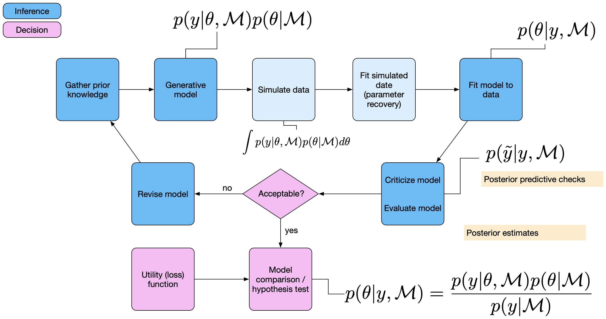
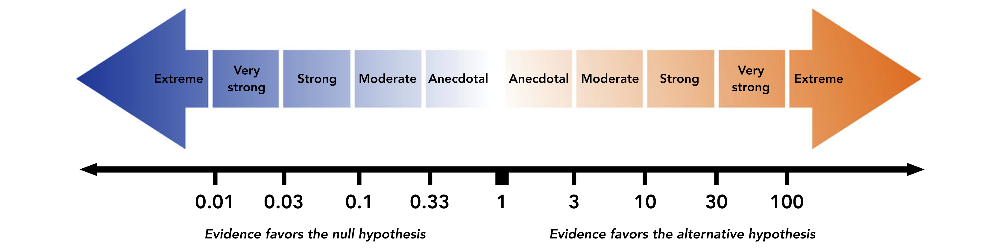

```{r child = "setup.Rmd"}
```

```{r load-packages}
library(tidyverse)
library(rmarkdown)
library(kableExtra)
library(countdown)

theme_set(theme_grey(base_size = 14) +
            theme(panel.grid = element_blank()))
```


## Introduction


.pull-left[
Sofar we have
-estimated parameters
- summarised posterior distributions
    + credible Intervals
    + point estimates

]

--

.pull-right[
We would like to be able to compare models:

- e.g.. model 1  explains the data better than model 2
- Model 1 has higher probability than model 2
]


---

.pull-left[
.discussion[
Which model comparison methods do you of?


- Look at the example. How would you go about showing that the intervention has an effect?
]
]

.pull-right[


```{r include=FALSE}
library(tidyverse)
intervention <- rep(c('treat', 'control'), each = 5)
pre <- c(20, 10, 60, 20, 10, 50, 10, 40, 20, 10)
post <- c(70, 50, 90, 60, 50, 20, 10, 30, 50, 10)

dwide <- tibble(id = factor(1:10), 
            intervention, pre, post) %>% 
  mutate(diff = post - pre,
         id = as_factor(id), 
         intervention =  factor(intervention, levels = c("control", "treat")))
d <- dwide %>% 
  select(-diff) %>% 
  pivot_longer(cols = pre:post, names_to = "time", values_to = "score") %>% 
  mutate(time = as_factor(time))
```

We have a within factor ("time") and a between factor (`intervention`).


```{r echo=FALSE, eval=TRUE}
d %>% 
  ggplot(aes(time, score, color = intervention)) +
  geom_line(aes(group = id), linetype = 1, size = 1) +
  geom_point(size = 4) +
  scale_color_viridis_d(end = 0.8) 
```


]

```{r echo=FALSE}
countdown(minutes = 3)
```

---

## Possible methods

- hypothesis testing, e.g.

.pull-left[
```{r eval=FALSE, include=TRUE}
t.test(diff ~ intervention,
       data = dwide)
```
]
.pull-right[
```{r eval=FALSE, include=TRUE}
m1 <- lmer(score ~ intervention + time + (1|id), 
                  data = d)
m2 <- lmer(score ~ intervention * time + (1|id), 
                  data = d)
```

]

- model comparison

    - explained variance

    - information criteria

    - cross validation

--

Let's look a Bayesian method for model comparison.

---

class: middle

.pull-left-narrow[
  .huge-blue-number[1]
]
.pull-right-wide[
  .larger[
  Theory
  ]
]


---

## Bayesian model comparison
We'll look at three methods

1) Bayes Factors

2) Out of sample predictive accuracy: Approximate leave-one-out cross validation (LOO)

3) Posterior predictive checking using test statistics (Posterior predictive p-values).

--

Let's begon with Bayes factors. These are not everybody's cup of tea; some statistians don't like them, whereas they are popular among psychologists, who often want to test hypotheses.

---

.panelset[
.panel[.panel-name[Bayesian workflow]

```{r echo=FALSE, fig.height=5, fig.width=7}

```

]

.panel[.panel-name[Posterior evaluation]

```{r echo = FALSE, out.width="80%"}
knitr::include_graphics("images/Bayesian-workflow-2.png")
```

]

.panel[.panel-name[Model comparison]

```{r echo = FALSE, out.width="80%"}

```

]
]

---

## Bayes factor

Bayes' theorem, explicitly showing the dependancy of the parameters $\mathbf{\theta}$ on the model $\mathcal{M}$.

$$ p(\theta | y, \mathcal{M}) = \frac{p(y|\theta, \mathcal{M}) p(\theta | \mathcal{M})}{p(y | \mathcal{M})}$$

$\mathcal{M}$ refers to a specific model.

--

$p(y | \mathcal{M})$ is the probability of the data, averaged over all possible parameter values of model  $\mathcal{M}$. It is known as the marginal likelihood.


--

.panelset[
.panel[.panel-name[Bayes theorem]

$$ P(\theta|Data) = \frac{ P(Data|\theta) * P(\theta) } {P(Data)} $$
]
.panel[.panel-name[Bayes theorem with marginal likelihood]
$$ P(\theta|Data) \propto P(Data|\theta) * P(\theta) $$
]
.panel[.panel-name[Marginal likelihood]

$$ p(y | \mathcal{M}) = \int_{\theta}{p(y | \theta, \mathcal{M}) p(\theta|\mathcal{M})d\theta} $$
To compuate the marginal likelihood, we have to average over all values of $\theta$.

]
]

---

## Complexity

- Marginal likelihood is also known as the __model evidence__. This depends on what kind of predictions a moedl can make.

- A model that makes many predictions is a complext model.

--
Complexity depends on


- Number of parameters

- Prior distributions of these parameters

--

In frequentist models priors don't exist, so it only depends on the number of parameters.

---

## Prior distributions

Uninformative priors make many predictions with low likelihood.


```{r}
n_points <- 100
theta_grid <- seq(from=0, to=1 , length.out = n_points)
likelihood <- dbinom(6, size = 9, prob = theta_grid)

compute_posterior = function(likelihood, prior){
  unstandardized_posterior <- likelihood * prior
  posterior <- unstandardized_posterior / sum(unstandardized_posterior)
  par(mfrow=c(1, 3))
  plot(theta_grid , prior, type="l", main="Prior", col = "dodgerblue3", lwd = 2)
  plot(theta_grid , likelihood, type="l", main="Likelihood", col = "firebrick3", lwd = 2)
  plot(theta_grid , posterior , type="l", main="Posterior", col = "darkorchid3", lwd = 2)
}
```

---

## Prior distributions

Uninformative priors make many predictions with low likelihood.


.panelset[
.panel[.panel-name[Uniformer Prior]
```{r}
prior <- dbeta(x = theta_grid, shape1 = 1, shape2 = 1)
compute_posterior(likelihood, prior)
```
]

.panel[.panel-name[Informative prior]

```{r}
prior <- dbeta(x = theta_grid, shape1 = 20, shape2 = 20)
compute_posterior(likelihood, prior)
```
]

.panel[.panel-name[Opiniated prior (wrong)]

```{r}
prior <- dbeta(x = theta_grid, shape1 = 2, shape2 = 40)
compute_posterior(likelihood, prior)
```
]

.panel[.panel-name[Opiniated prior (better)]

```{r}
prior <- dbeta(x = theta_grid, shape1 = 48, shape2 = 30)
compute_posterior(likelihood, prior)
```
]
]


---

## Ockham's Razor

- Complex models have a lower marginal likelihood
- If we prefer models with higher marginal likelihood, we are choosing the more parsimonious model.


--


Bayes theorem


$$ p(\mathcal{M}_1 | y) = \frac{P(y | \mathcal{M}_1) p(\mathcal{M}_1)}{p(y)} $$

und

$$ p(\mathcal{M}_2 | y) = \frac{P(y | \mathcal{M}_2) p(\mathcal{M}_2)}{p(y)} $$


---

## Modelcomparison

Model odds

$$ \frac{p(\mathcal{M}_1 | y) = \frac{P(y | \mathcal{M}_1) p(\mathcal{M}_1)}{p(y)}} {p(\mathcal{M}_2 | y) = \frac{P(y | \mathcal{M}_2) p(\mathcal{M}_2)}{p(y)}} $$

--

$p(y)$ can be eliminated.


--


$$\underbrace{\frac{p(\mathcal{M}_1 | y)} {p(\mathcal{M}_2 | y)}}_\text{Posterior odds} = \frac{P(y | \mathcal{M}_1)}{P(y | \mathcal{M}_2)} \cdot \underbrace{ \frac{p(\mathcal{M}_1)}{p(\mathcal{M}_2)}}_\text{Prior odds}$$

--

<br>

$\frac{p(\mathcal{M}_1)}{p(\mathcal{M}_2)}$ are the **prior odds**, and $\frac{p(\mathcal{M}_1 | y)}{p(\mathcal{M}_2 | y)}$ are the **posterior odds**.


---

Assuming the prior odds are 1, we are only interested in the ratio of marginal likelihoods.

$$ \frac{P(y | \mathcal{M}_1)}{P(y | \mathcal{M}_2)} $$

--

This term is called the **Bayes factor**: it is multiplied with the prior odds, and indicates under which model the data are more likely.


We write $BF_{12}$ - this is the Bayes factor for model 1 vs model 2.

$$ BF_{12} = \frac{P(y | \mathcal{M}_1)}{P(y | \mathcal{M}_2)}$$


--


$BF_{12}$ indicates the degree of evidence provide by the data for  $\mathcal{M}_1$ , relative to  $\mathcal{M}_2$.

Example: $BF_{12} = 5$: the data are 5 times more probable under model 1 than under model 2.


---

## Classification

```{r echo = FALSE, out.width="80%"}
  
```


---

## Bayes factor

- BF depend on the prior distributions.
- BF Are challenging to compute.

    + Savage-Dickey Density Ratio with `Stan`/`brms`
    
    + Package [BayesFactor](https://cran.r-project.org/web/packages/BayesFactor/vignettes/manual.html) (for general linear models)
    
    + [JASP](https://jasp-stats.org/): a GUI for `BayesFactor`
    
    + Bridge sampling with `brms`: diffucult to use, but the most reliable


---

class: middle

.pull-left-narrow[
  .huge-blue-number[2]
]
.pull-right-wide[
  .larger[
  Anwendung: Binomial model
  ]
]


---


## Savage-Dickey Density Ratio

If we have two nested models, we can use the Savage-Dickey density ratio.


Under the null model: $H_0: \theta = \theta_0$

Under the alterantive model: $H_1: \theta \neq \theta_0$

--

$\theta$ needs a distribution under model 1, e.g.. $\theta \sim \text{Beta}(1, 1)$

--

The Savage-Dickey density ratio trick: We look at model 1 and divide the posterior by the prior density at the null value $\theta_0$.

.footnote[
In the mull model the parameter is fixed (point hypothesis).
]


---

## Savage-Dickey Density Ratio

Let's look at an example from Wagenmakers (2010):

You observe that someboy corrcetly answers 9 out of 10 questions 

```{r}
d <- tibble(s = 9, k = 10)
```

What is probability that this happend by chance ( $\theta = 0.5$ )?


.footnote[
Wagenmakers, Eric-Jan, Tom Lodewyckx, Himanshu Kuriyal, and Raoul Grasman. “Bayesian Hypothesis Testing for Psychologists: A Tutorial on the Savage–Dickey Method.” Cognitive Psychology 60, no. 3 (May 1, 2010): 158–89. https://doi.org/10.1016/j.cogpsych.2009.12.001.
]

---


.panelset[
.panel[.panel-name[Prior]
```{r echo=FALSE}
pd <- tibble(
  x = seq(0, 1, by = .01),
  Prior = dbeta(x, 1, 1)
)
ggplot(pd, aes(x, Prior)) +
  geom_line(size = 1.5) +
  coord_cartesian(xlim = 0:1, ylim = c(0, 6), expand = 0.01) +
  labs(y = "Density", x = bquote(theta))
```
]


.panel[.panel-name[Posterior]

```{r echo=FALSE, preview=TRUE}
pd <- pd %>% 
  mutate(Posterior = dbeta(x, 9+1, 1+1))

pdw <- pd %>% 
  pivot_longer(names_to = "Type", 
               values_to = "density", 
               Prior:Posterior)
pdw %>% 
  ggplot(aes(x, density, col = Type)) +
  geom_line(size = 1.5) +
  scale_x_continuous(expand = expansion(0.01)) +
  scale_color_viridis_d(end = 0.8) +
  labs(y = "Density", x = bquote(theta)) +
  annotate("point", x = c(.5, .5), 
           y = c(pdw$density[pdw$x == .5]),
           size = 4) +
  annotate("label",
    x = c(.5, .5),
    y = pdw$density[pdw$x == .5],
    label = round(pdw$density[pdw$x == .5], 3),
    vjust = -.5
  )
```


```{r echo = FALSE}
filter(pd, x == .5) %>%
  mutate(
    BF01 = Posterior / Prior,
    BF10 = 1 / BF01
  ) %>%
  kable(caption = "Bayes Factors.", digits = 3) %>% 
  kable_styling(full_width = FALSE)
```
]
]


---

## Savage-Dickey Density Ratio 


.panelset[
.panel[.panel-name[Formula]


```{r message=FALSE, warning=FALSE}
library(brms)

m1_formula <- bf(
  s | trials(k) ~ 0 + Intercept,
  family = binomial(link = "identity"))
```

]

.panel[.panel-name[Get Priors]

```{r, message = F}
get_prior(m1_formula, 
          data = d)
```
]
.panel[.panel-name[Set Priors]

```{r}
priors <- set_prior("beta(1, 1)", 
                   class = "b", 
                   lb = 0, ub = 1)
```

]

.panel[.panel-name[Posterior]

```{r, results='hide'}
m1 <- brm(m1_formula,
         prior = priors,
         data = d,
         sample_prior = TRUE, #<<
         file = "models/05-m1")
```

]
.panel[.panel-name[Summary]

```{r}
summary(m1)
```

]
]

---

## Posterior summary

```{r}

m1 %>% 
  mcmc_plot(c("b_Intercept", "prior_b"))
```


---

## Prior and posterior

.pull-left[
```{r echo = 1}
samples <- m1 %>% 
  posterior_samples("b")

head(samples) %>% 
  kable(digits = 2, caption = "Six first rows of posterior samples.") %>% 
  kable_styling(full_width = FALSE)

```

]

.pull-right[

```{r}
samples %>% 
  pivot_longer(everything(), 
               names_to = "Type", 
               values_to = "value") %>%
  ggplot(aes(value, color = Type)) +
  geom_density(size = 1.5) +
  scale_color_viridis_d(end = 0.8) +
  labs(x = bquote(theta), y = "Density") +
  geom_vline(xintercept = .9) 
```

]

---

## Savage-Dickey Density Ratio 

### With `brms`


```{r echo = -1}
options(width = 120)

h <- m1 %>% 
  hypothesis("Intercept = 0.5")

print(h, digits = 4)
```


---

## Savage-Dickey Density Ratio 

```{r}
plot(h)
```


---

class: middle

.pull-left-narrow[
  .huge-blue-number[3]
]
.pull-right-wide[
  .larger[
  NOrmal distribution
  ]
]


---

## Bayes factor for comparing two means

```{r}
smart = tibble(IQ = c(101,100,102,104,102,97,105,105,98,101,100,123,105,103,
                      100,95,102,106,109,102,82,102,100,102,102,101,102,102,
                      103,103,97,97,103,101,97,104,96,103,124,101,101,100,
                      101,101,104,100,101),
               Group = "SmartDrug")

placebo = tibble(IQ = c(99,101,100,101,102,100,97,101,104,101,102,102,100,105,
                        88,101,100,104,100,100,100,101,102,103,97,101,101,100,101,
                        99,101,100,100,101,100,99,101,100,102,99,100,99),
                 Group = "Placebo")

TwoGroupIQ <- bind_rows(smart, placebo)  %>%
    mutate(Group = fct_relevel(as.factor(Group), "Placebo"))
```


---

```{r}
t.test(IQ ~ Group,
       data = TwoGroupIQ)
```


---

.panelset[
.panel[.panel-name[Formula]

```{r}
m2_formula <- bf(IQ ~ 1 + Group)
```

]

.panel[.panel-name[Get Priors]


```{r}
get_prior(m2_formula,
          data = TwoGroupIQ)
```
]

.panel[.panel-name[Set Priors]

```{r}
priors = c(set_prior("normal(0, 1)",
                    class = "b", coef = "GroupSmartDrug"))
```

]

.panel[.panel-name[Posterior]

```{r}
m2 <- brm(m2_formula,
          prior = priors,
          data = TwoGroupIQ,
          cores = parallel::detectCores(),
          sample_prior = TRUE,
          file = here::here("models/05-m2-iq-bf"))
```


]

.panel[.panel-name[Summary]

```{r}
summary(m2)
```
]
]

---

```{r}
m2 %>% 
  mcmc_plot("GroupSmartDrug")
```

---


```{r}
BF <- hypothesis(m2,
                hypothesis = 'GroupSmartDrug = 0')

BF
```


```{r}
1/BF$hypothesis$Evid.Ratio
```


